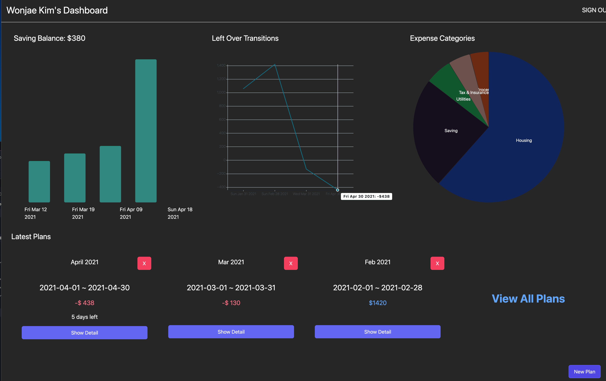

# The Economizer (Front End)

CICCC WAMD Node.js course Final Project.
Using Next.js with typescript, PWA.
## Overview

Set your monthly saving plan and manage it!

### Pages

Signin
Dashboard
Plan Detail

### Functions 
Add new budget plan
Add / Edit / Delete detail of your expense / income record
This generate Charts of your savings, left over of plan, and expence categories.
